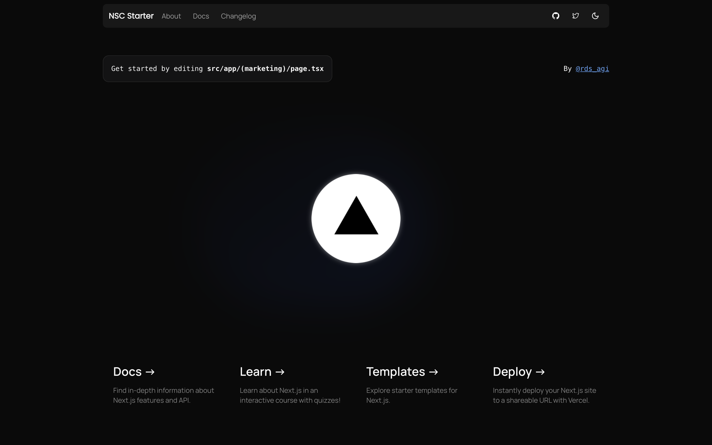

# Next.js Starter Template



This is a Next.js starter template designed to help you quickly build modern web applications. It includes a well-organized folder structure, out-of-the-box layouts, theming, navigation, and adherence to industry-standard code conventions.

## Table of Contents

- [Next.js Starter Template](#nextjs-starter-template)
  - [Table of Contents](#table-of-contents)
  - [Features](#features)
  - [Getting Started](#getting-started)
    - [Installation](#installation)
  - [Folder Structure](#folder-structure)
  - [Usage](#usage)
  - [Customization](#customization)
  - [Contributing](#contributing)
  - [License](#license)

## Features

- **Next.js App Router:** Leverages the latest Next.js (13/14) app router for modern routing with support for nested layouts and seamless navigation.
- **Tailwind CSS:** Integrated for responsive design and utility-first styling.
- **ShadCN UI:** Includes a set of modern, reusable UI components.
- **TypeScript Support:** Built-in TypeScript for strong typing and better development experience.
- **Theming:** Light and dark theme support with easy toggling.
- **Organized Folder Structure:** Easy-to-navigate project structure to keep your code clean and maintainable.
- **Industry-Standard Code Conventions:** Adheres to best practices for code quality and consistency.

## Getting Started

Follow these steps to set up the project locally:

### Installation

1. **Clone the repository:**

   ```bash
   git clone https://github.com/rudrodio/nsc-starter.git
   cd nsc-starter
   ```

2. **Install dependencies:**

   ```bash
   npm install
   # or
   yarn install
   # or
   pnpm install
   # or
   bun install
   ```

3. **Run the development server:**

   ```bash
   npm run dev
   # or
   yarn dev
   # or
   pnpm dev
   # or
   bun dev
   ```

   Open [http://localhost:3000](http://localhost:3000) in your browser to see the result.

## Folder Structure

The project follows a modular structure that makes it easy to expand and maintain:

```
├── public
├── src
│   ├── app
│   │   ├── (marketing)
│   │   │   ├── layout.tsx
│   │   │   └── page.tsx
│   │   ├── error.tsx
│   │   ├── layout.tsx
│   │   └── not-found.tsx
│   ├── components
│   │   ├── root-provider.tsx
│   │   ├── theme
│   │   └── ui
│   ├── config
│   ├── hooks
│   ├── lib
│   ├── styles
│   │   └── globals.css
│   └── types
│       └── index.d.ts
```

- **public/**: Static assets like images, fonts, and icons.
- **src/app/**: Main application code using Next.js app router.
- **src/components/**: Reusable UI components and layout elements.
- **src/config/**: Configuration files for different sections of the application.
- **src/hooks/**: Custom React hooks.
- **src/lib/**: Utility functions.
- **src/styles/**: Global CSS and styles.
- **src/types/**: TypeScript type definitions.

## Usage

This template provides a starting point for building web applications with Next.js. You can customize it according to your needs:

- **Pages:** Add or modify pages in the `src/app` directory.
- **Components:** Create or update reusable components in the `src/components` directory.
- **Theming:** Customize themes in the `src/components/theme` directory.
- **Configuration:** Adjust site and marketing configurations in the `src/config` directory.

## Customization

You can easily customize this template to fit your project’s requirements:

- **Layouts:** Modify the layout files to create unique layouts for different sections.
- **Styling:** Use Tailwind CSS to style your components and pages.
- **Components:** Extend the UI components or create your own in the `src/components/ui` directory.
- **Theming:** Adjust the theme provider and toggler to implement custom themes.

## Contributing

Contributions are welcome! Please follow these steps to contribute:

1. Fork the repository.
2. Create a new branch (`git checkout -b feature/your-feature`).
3. Make your changes and commit them (`git commit -m 'Add some feature'`).
4. Push to the branch (`git push origin feature/your-feature`).
5. Open a Pull Request.

Please ensure your code follows the project’s coding conventions and passes linting.

## License

This project is licensed under the MIT License. See the [LICENSE](./LICENSE.md) file for more details.
